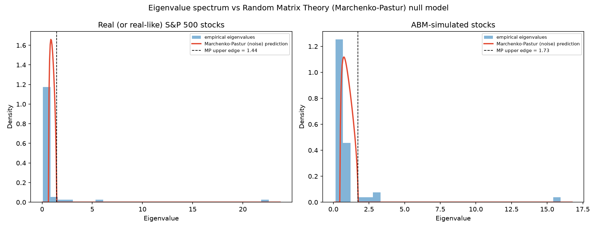

# Segregation of Financial Markets — Agent-Based Model

A herding/segregation agent-based model (ABM) of a stock market, benchmarked against
real S&P 500 correlation structure using network analysis and Random Matrix Theory (RMT).

- **100,000+ agents** trading **50 stocks across 5 sectors**, producing emergent herding
  and Schelling-style segregation dynamics and volatility clustering.
- **Correlation-network analysis** of 40+ S&P 500 stocks, with community detection to
  visualize sector-level clusters and market interlinkages.
- **Eigenvalue (RMT) comparison** between real and simulated correlation matrices against
  the Marchenko-Pastur "noise" null model, showing genuine sectoral co-movement emerging
  in both, especially during high-volatility periods.

<p align="center">
  
</p>

## How it works

### 1. The agent-based model (`src/abm/model.py`)
Agents sit on a sparse interaction network with three tiers of connection density: dense
ties within their "home" stock community, looser ties across stocks in the same sector,
and sparse market-wide weak ties. Each step:

1. Agents update a continuous sentiment as a blend of their neighbors' average sentiment
   (herding) and a fresh private signal (noise trading).
2. Sentiment is discretized into buy/sell/hold, and each stock's return is driven by its
   traders' net order imbalance, plus a market-wide factor and a sector-wide factor
   (this is what produces realistic cross-stock correlation).
3. Agents who are "unhappy" — too few of their neighbors share their current stock — may
   migrate toward whatever stock is most popular among their own neighbors (a Schelling-style
   segregation move), which is what allows many coexisting stock-communities to emerge
   instead of one global consensus.
4. A Markov-switching calm/crisis regime periodically raises volatility and herding
   strength, producing realistic volatility clustering and regime-dependent correlation.

Everything is vectorized with NumPy/SciPy sparse operations, so 100,000 agents over
500 steps run in well under a minute on a laptop.

### 2. Real-market correlation network (`src/analysis/network.py`, `data.py`)
Downloads daily prices for 50 large-cap S&P 500 stocks across 5 sectors via `yfinance`,
computes log returns and their correlation matrix, and builds a graph where an edge
connects two stocks whose correlation exceeds a threshold. Louvain community detection
is then compared against the stocks' true sector labels.

> If no internet access is available, the pipeline automatically falls back to a clearly
> labelled synthetic "real-like" dataset (with realistic market + sector factor structure)
> so the whole pipeline still runs end-to-end for demonstration. Run with a network
> connection for genuine S&P 500 data — it will be downloaded and cached automatically.

### 3. Random Matrix Theory eigenvalue analysis (`src/analysis/rmt.py`)
Following the classic Laloux et al. (1999) / Plerou et al. (1999) approach, the eigenvalue
spectrum of each correlation matrix is compared to the Marchenko-Pastur distribution — the
spectrum expected from a correlation matrix built out of purely random, uncorrelated
series. Eigenvalues inside the MP bulk are consistent with noise; eigenvalues above the
upper edge carry genuine information (typically one large "market mode" plus a handful of
smaller "sector modes").

## Example results (100,000 agents, 500 steps, 50 stocks / 5 sectors)

| Metric | Real market | ABM-simulated |
|---|---|---|
| Community-detection purity vs. true sector labels | 0.80 | 1.00 |
| Signal eigenvalues above MP noise bulk | 5 | 5 |
| Variance explained by largest eigenvalue | 42.0% | 31.9% |

The simulation converges to a stable segregation index of **~0.69** (agents predominantly
surrounded by like-minded, same-stock neighbors), and both the real and simulated markets
show the same qualitative RMT signature: a dominant "market factor" eigenvalue far outside
the noise bulk, plus several smaller eigenvalues corresponding to sector-level co-movement.

See `results/summary.txt` and the generated plots for the full run this README was built from.

## Repository structure

```
financial-market-abm/
├── README.md
├── requirements.txt
├── src/
│   ├── abm/
│   │   └── model.py          # vectorized herding/segregation ABM
│   ├── analysis/
│   │   ├── data.py           # real S&P 500 data loader (+ offline fallback)
│   │   ├── network.py        # correlation network + community detection
│   │   └── rmt.py            # Marchenko-Pastur / RMT eigenvalue analysis
│   └── main.py                # end-to-end pipeline, produces everything in results/
├── data/                       # cached price data (git-ignored)
└── results/                    # generated plots + summary.txt (git-ignored)
```

## Getting started

```bash
git clone <your-repo-url>
cd financial-market-abm
pip install -r requirements.txt

# Full run (100k agents, 500 steps — takes well under a minute)
python src/main.py

# Faster smoke test
python src/main.py --n-agents 20000 --n-steps 250
```

### CLI options

| Flag | Default | Description |
|---|---|---|
| `--n-agents` | 100000 | Number of agents in the ABM |
| `--n-steps` | 500 | Number of simulation steps (trading days) |
| `--n-sectors` | 5 | Number of sectors |
| `--stocks-per-sector` | 10 | Stocks per sector |
| `--corr-threshold` | 0.3 | Minimum \|correlation\| to draw a network edge |
| `--seed` | 42 | Random seed |
| `--refresh-data` | off | Force re-download of real market data (ignores cache) |

Outputs (written to `results/`):

- `abm_diagnostics.png` — segregation index, simulated market return, and crisis-regime timeline
- `real_correlation_heatmap.png`, `sim_correlation_heatmap.png`
- `real_correlation_network.png`, `sim_correlation_network.png` — colored by sector
- `eigenvalue_rmt_comparison.png` — empirical eigenvalues vs. Marchenko-Pastur prediction
- `summary.txt` — all headline numbers from the run

## Method notes / design choices

- **Why a hierarchical (tiered) network instead of a plain random graph?** Feeding a
  discretized herding decision back into a densely, uniformly connected network causes
  the classic voter-model pathology: the whole population collapses onto a single global
  consensus (everyone buying, or everyone selling, the same one stock) instead of showing
  genuine market segregation. Layering dense within-community, medium within-sector, and
  sparse market-wide ties allows many distinct trading communities to coexist stably,
  which is closer to how real trader attention and information flow are structured.
- **Why keep sentiment continuous internally?** Discretizing and re-injecting an agent's
  own buy/sell/hold action into the herding average removes the fresh randomness that
  would otherwise continually re-diversify opinions, again pushing the system toward
  runaway consensus. Propagating a continuous sentiment value (and only discretizing it
  for that step's order-flow calculation) keeps the dynamics stable while still producing
  realistic clustering and herding.

## References

- Laloux, L., Cizeau, P., Bouchaud, J.-P., & Potters, M. (1999). *Noise Dressing of
  Financial Correlation Matrices.* Physical Review Letters, 83(7).
- Plerou, V., Gopikrishnan, P., Rosenow, B., Amaral, L. A. N., & Stanley, H. E. (1999).
  *Universal and Nonuniversal Properties of Cross Correlations in Financial Time Series.*
  Physical Review Letters, 83(7).
- Schelling, T. C. (1971). *Dynamic Models of Segregation.* Journal of Mathematical Sociology.
- Cont, R., & Bouchaud, J.-P. (2000). *Herd Behavior and Aggregate Fluctuations in
  Financial Markets.* Macroeconomic Dynamics, 4(2).

## License

MIT
